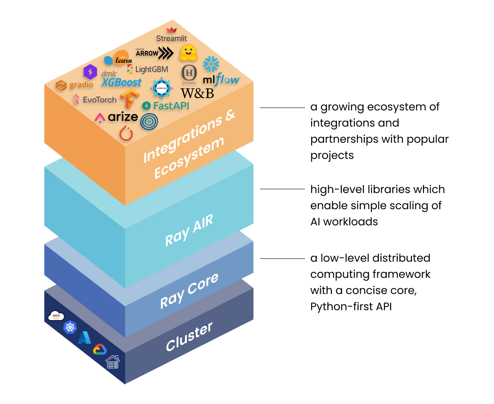

Short guide for working with Ray
================================

This section describes how to work with `Ray <https://docs.ray.io/en/master/index.html>`_.
Specifically, we will discuss how to do distributed computing with the Ray library use the C++ API.

.. note::

	Ray is a Python library aiming at facilitating distributed computing
	of Python programs. It exposes an API that can be used by C++ programs
	however, at the time of writing, this API is not as mature as the Python counterpart.

Install Ray
-----------

Ray is a Python library that exposes a C++ API. Thus, you can use ``pip`` in order to install it
on your system: 

.. code-block::

	pip install ray 
	

See the official `Installing Ray <https://docs.ray.io/en/latest/ray-overview/installation.html>`_ page for more options.
However, in our case we want to install Ray alongside its C++ API so install it using:

.. code-block::

	pip install -U ray[cpp]

Assuming that everything has worked fine, let's generate a project template. This is what we will be using
throughout this tutorial.

.. code-block::

	ray cpp --generate-bazel-project-template-to ray-template
	
The command above will create a directory called ``ray-template`` with the following structure

.. code-block::

	BUILD.bazel
	example.cc
	run.sh
	thirdparty
	WORKSPACE
	
Let's now review the core componets of Ray. You can find more information at 
`Overview of Ray <https://github.com/ray-project/ray-educational-materials/blob/main/Introductory_modules/Overview_of_Ray.ipynb>`_.

Ray core components
--------------------

Ray consists of a number of libraries.
These are:

- Ray core
- Ray AIR
- Ray cluster

Schematically these are shown in the image below

	Stack of Ray libraries. Image from [1].

Ray core
---------

Ray core is a rather low-level distributed computing framework. Its main key abstractions are

- `Tasks <a href="https://docs.ray.io/en/latest/ray-core/tasks.html">`_
- `Actors <https://docs.ray.io/en/latest/ray-core/actors.html>`_
- `Objects <https://docs.ray.io/en/latest/ray-core/objects.html>`_

With Ray we can execute arbitrary functions on separate workers.
These are called remote functions and asynchronously invocing such a remote
function is called a Task.

A Ray task is just a function that is executed asynchronously.
A function cannot hold any state and this sometimes may be problematic.
If our application requires stateful computing, we will have to use
another Ray core abstraction namely an Actor.  A Ray Actor 
is essentially a worker that can hold state. Every time we create a new
actor a new worker will be created. 
The methods of the actor are scheduled on that specific worker and can access and mutate the state of that worker.

See example `Using Ray core Tasks, Actors and Objects <examples/ray/ray_example_1.html>`_ 
about how to use these abstractions in C++. 

In Ray, tasks and actors create and compute on objects. We refer to these objects as 
remote objects because they can be stored anywhere in a Ray cluster, and we use object refs to refer to them. 
Remote objects are cached in Ray’s distributed shared-memory object store, and there is one object store per 
node in the cluster. In the cluster setting, 
a remote object can live on one or many nodes, independent of who holds the object ref(s).

References
-----------

1. `Overview of Ray <https://github.com/ray-project/ray-educational-materials/blob/main/Introductory_modules/Overview_of_Ray.ipynb>`_